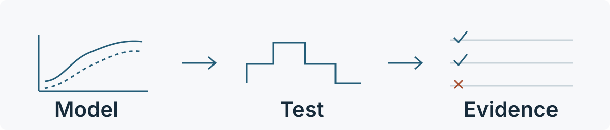
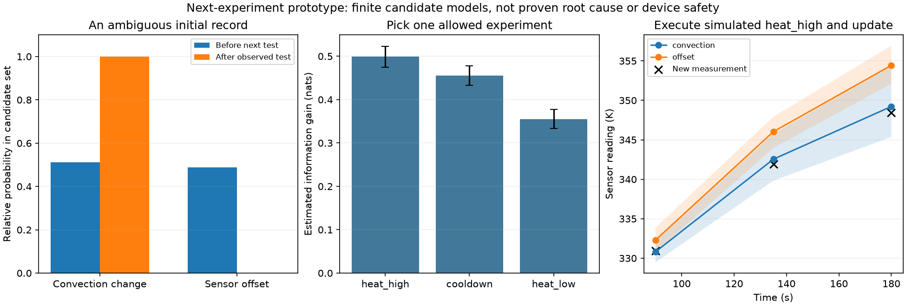

# Thermal Experiment Research

**What should you measure next when a thermal model disagrees with the data?**

**Thermal Experiment Research** is a Python research archive for **thermal modeling, parameter calibration and model discrimination through experimental design**. Its prototype selects the next allowed test to distinguish convection changes from sensor offset. The full notebook keeps heat-equation checks, constrained heating, negative results and execution records—not just a successful demo.

[中文](README.zh-CN.md) · [Try the prototype](#try-the-prototype) · [Research map](#research-map) · [FAQ](#faq) · [Citing this work](CITATION.md)



**Research prototype—not a device controller or an industrial digital twin.** The next-experiment demonstrations are synthetic; the new [TCLab case study](real_data/tclab/RESULTS.md) additionally replays an author's public measured sample. There is no independently verified hardware, equipment-company partnership, or evidence that a new AI algorithm outperforms established methods.

## A working research loop

The current prototype compares **changed convection** with **sensor offset**, while allowing uncertainty in absorbed-power gain and heat capacity:

1. Read a task and its existing measurements.
2. Compare a finite ensemble of candidate models.
3. Recommend an enabled, budget-feasible experiment—or abstain.
4. Record an explicit research review before accepting a new measurement.
5. Update relative support without forcing a diagnosis or granting engineering release.



[Open the full-size plot](next_experiment/demo/decision.png) · [Read the generated experiment card](next_experiment/demo/recommendation.md) · [Review the workflow result](next_experiment/workflow_run/completed/report.md)

The recorded example starts at roughly **51% / 49%** candidate support. It recommends `heat_high`; the simulated new measurement shifts support toward convection change. Tightening the declared temperature screen to 360 K instead selects `cooldown`. These are finite-model predictions, **not certified probabilities or safe operating instructions**.

## Try the prototype

For browsing and file-integrity checks, Python's standard library is enough:

```sh
python workbench.py list
python workbench.py check
```

To execute the prototype, use Python 3.12 and the existing two-package lock. Install [uv](https://docs.astral.sh/uv/getting-started/installation/) separately if needed:

```sh
python3.12 -m venv --without-pip .venv
uv pip install --python .venv/bin/python --require-hashes --only-binary :all: \
  -r requirements-thermal.lock

# Stops at a proposal awaiting review; creates a NEW directory.
.venv/bin/python next_experiment/demo_workflow.py --output /tmp/thermal-review

# Explicit opt-in: run the complete synthetic plan → review → observe loop.
.venv/bin/python next_experiment/demo_workflow.py \
  --output /tmp/thermal-simulated-loop --approve-simulation
```

Use new output paths on every run. Nothing here connects to equipment. The simulation reviewer is a local label, not authenticated approval. Linux x86_64 / CPython 3.12.8 was exercised; other platforms require validation.

[Task and observation formats](next_experiment/GUIDE.md) · [Plan / review / observe commands](next_experiment/WORKFLOW.md)

## What the experiments actually show

| Finding | Evidence and limit |
|---|---|
| A lower training error did not predict the next heating segment better | On the author-provided two-heater sample, the independent model fit the first 300 seconds better but had higher subsequent RMSE than the coupled model. One recorded run, not an active-experiment trial. [Measured case](real_data/tclab/RESULTS.md) |
| The next-test loop runs | CLI recommendation, review and observation update execute in separate processes; ambiguous and unsupported outcomes are retained. [Workflow results](next_experiment/WORKFLOW_RESULTS.md) |
| More complex selection did not win | On 16 synthetic cases, information gain and a simple separation heuristic both made 13 decisions with 3 abstentions. Fixed cooldown had a slightly lower Brier score. [Comparison](next_experiment/RESULTS.md) |
| A good fit can miss an error | A frozen residual rule still missed 5 inadequate predictions after the additional diagnostic experiment; numerical refinement preserved the misses. [Bias boundary](bias_boundary/RESULTS.md) |
| A reference can transfer its own error | A +0.35 K reference bias left 4 corrected predictions inadequate and unflagged in the recorded paired study. [Reference correction](reference_correction/RESULTS.md) |
| Calibration helps under stated assumptions | Effective-parameter calibration improved held-out prediction in a matched synthetic model family; it does not recover absolute physical properties or prove real-device reliability. [Calibration](calibration/RESULTS.md) |

Sample counts are not field failure probabilities. Replicates, shared observations, finite grids and noise assumptions are documented in each study; do not combine them into a marketing benchmark.

For a concise, source-linked description of the project, its methods and its current limits, see [Project facts](docs/PROJECT_FACTS.md). For a result you want to quote, cite the particular study and its recorded protocol—not this repository's title alone.

## Research map

This repository keeps the **whole investigation**, including unsuccessful approaches and earlier development runs. Start with the question you need—not every directory in order.

| Stage | Question / entry point |
|---|---|
| Literature and product direction | [What exists already?](report.md) · [Who is the proposed user?](PRODUCT_DIRECTION.md) |
| `feasibility/` | [Do the upstream examples run, and does the heat solution converge?](feasibility/RESULTS.md) |
| `radiation/` | [Can constrained heating be optimized with nonlinear radiation?](radiation/RESULTS.md) |
| `sensitivity/` | [How fragile is the nominal plan, and which parameters cannot be identified?](sensitivity/RESULTS.md) |
| `calibration/` | [Does effective-ratio calibration improve a held-out trajectory?](calibration/RESULTS.md) |
| `model_mismatch/` | [Does a converged fit reveal unknown model/sensor errors?](model_mismatch/RESULTS.md) |
| `bias_boundary/` | [Where does the fixed residual warning miss small bias?](bias_boundary/RESULTS.md) |
| `reference_correction/` | [When does one-point correction help or mislead?](reference_correction/RESULTS.md) |
| `next_experiment/` | [Choose the next test](next_experiment/GUIDE.md) · [Reviewable workflow](next_experiment/WORKFLOW.md) |
| `evidence_report/` and `tools/` | [Report without claiming safety](evidence_report/RESULTS.md) · [Isolated scientific replay](tools/THERMAL_REPLAY_RESULTS.md) |

Every study retains its protocol and results. `sources/` and `product_research/` provide reference URLs, original capture hashes and source notices rather than redistributing third-party full text. `development/`, prior attempts, logs and synthetic data are retained. See the [public-edition reference policy](docs/REFERENCE_POLICY.md) and [archive history](docs/ARCHIVE.md).

## Check versus reproduce

```sh
# Standard-library checks: imported archive, pinned snapshots, entrypoint tests.
python scripts/check.py --quick

# Also run evidence-report, prototype/workflow and array-verification tests.
.venv/bin/python scripts/check.py

# Actual NEW ODE/optimization run, not just an integrity check.
python tools/replay_thermal.py --python .venv/bin/python \
  --output /tmp/thermal-scientific-replay
```

The CI definition runs the same full check command; it does not rerun every historical experiment, create plots, or certify physics. Some old standalone verification scripts write result files—read the stage instructions before running them. [Reproduction guide](docs/REPRODUCE.md).

## Scope and next step

The model uses explicitly stated teaching parameters and synthetic observations. The next-test adapter is limited to two mechanism families, finite parameter grids, known initial equilibrium and independent Gaussian noise. Reference availability must be declared; even then, its accuracy is not automatically verified. Every output remains **`engineering_release=not_supported`**.

The next useful contribution is a public or authorized thermal-model mismatch case from a real researcher/engineer—not another generic agent framework. We have not yet established external user value, company adoption or an AI performance advantage. [Contribution guide](CONTRIBUTING.md).

## FAQ

### Can I upload any CSV and receive a diagnosis?

No. The current adapter requires a JSON task, known measurement positions/times and declared noise. It uses the included thermal model and two candidate mechanism families; it does not infer arbitrary equipment physics from a CSV. Start with the [input format](next_experiment/GUIDE.md).

### Does this use an LLM, reinforcement learning or an autonomous scientist?

No. The current next-test prototype uses a finite-ensemble Bayesian update and estimated information gain. Its review workflow is deterministic orchestration. The research concerns AI4Engineering, but it does not establish an AI advantage over classical methods. See the [actual comparison](next_experiment/RESULTS.md).

### Is this a replacement for BayBE, Pyomo.DoE or do-mpc?

No. This is a bounded thermal research case with explicit failure examples, not a general-purpose experimental-design or control framework. The [related-tool review](PRODUCT_DIRECTION.md#3-实际查到的已有工作) explains the overlap; it is not a head-to-head benchmark against those packages.

### Can I run it without a GPU or hardware access?

Yes, the synthetic next-test workflow and thermal replay use NumPy and SciPy on CPU. No model API key or equipment connection is required. A simulated review does not approve a real experiment. See [reproduction instructions](docs/REPRODUCE.md) and [citation/provenance guidance](CITATION.md).

## License and publication

**No blanket open-source license has been selected for the original work.** Public visibility is not a new license grant. The public edition omits external paper binaries and replaces third-party reference bodies with source notices; retained py-pde/BoTorch examples include their MIT notices. Read [THIRD_PARTY.md](THIRD_PARTY.md) and the [publication record](docs/PUBLICATION.md). No project-specific DOI, paper or package release is claimed.
