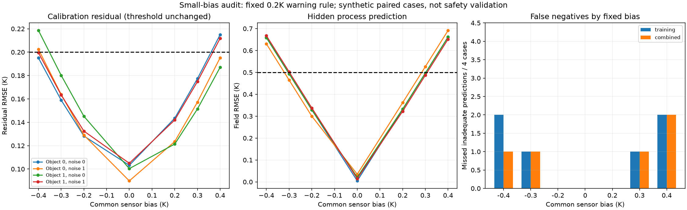

# 第六阶段：已找到小残差下预测不达标的漏报

日期：2026-09-24。性质：冻结原告警规则的合成配对实验，不是安全认证或真实故障概率估计。

## 结论与项目影响

**第五阶段的零漏报不能推广。** 保持同一拟合器、同一告警阈值和同一隐藏评分标准，本轮在预设28例中得到10个预测不达标案例。只用标定残差漏报6个，加上额外诊断仍漏报5个。

11个预设规则选出的精化案例均无隐藏标签翻转；5个组合漏报在96单元重新计算标定/诊断残差后仍未告警，192单元隐藏预测仍不达标。不能把这些反例简单归因于网格精度。

因此当前系统只能输出“残差是否超过研究阈值”，**不能以未告警为由放行工程方案或标记模型已可信**。项目下一步应研究可检验的绝对温度参考、传感器零偏校正或观测设计，而不是继续包装现有阈值规则。

## 控制变量与样本

- 新2个物理对象，Sobol seed=20260927，原五类参数乘子范围[0.9,1.1]；没有使用之前已查看的对象结果来筛选。
- 每对象2个高斯噪声实现，标准差0.1K；对同一对象/噪声实现，所有偏置共享同一标定和诊断噪声。
- 共同加性偏置为−0.4、−0.3、−0.2、0、+0.2、+0.3、+0.4K。两对象×两噪声×七幅度=28次拟合；不是28个独立设备。
- 每次拟合仍使用原240秒标定轨迹的144个观测。独立诊断再增加144个观测，但诊断传感器也受到同一偏置污染，不能充当真实温度参考。
- 原fit_ratios、residual_alarm和prediction_score源码按哈希冻结。28次拟合全部报告收敛，未改变参数边界、初值、最多40次nfev或告警阈值。
- 隐藏物理温度场对同一对象完全共享：偏置只改变观测，不改变真实初温、功率指令、物理参数或工艺目标。
- 拟合结果与告警先保存并冻结，然后评分隐藏180秒输入；无隐藏数据回流拟合或告警。

## 判据没有改变

标定告警：未收敛，或残差RMSE>0.2K，或任一传感器平均残差绝对值>0.2K。

组合告警：标定告警触发，或诊断残差RMSE>0.2K，或任一诊断传感器平均残差绝对值>0.2K。

隐藏“预测不达标”：全场RMSE>0.5K或末态均温绝对误差>1K。本轮最大末态均温误差约0.525K，全部不达标标签由全场RMSE触发；不能将它说成“最终温度已经超限”或实际控制器安全事故。

这些阈值是研究设定。0.2K不是经过假阳性率校准的统计阈值，0.5K也不是企业工艺容差。

## 完整幅度结果

每行4个对象/噪声组合；FP均为0。

| 共同偏置 | 隐藏不达标 | 标定检出TP | 标定漏报FN | 组合检出TP | 组合漏报FN |
|---|---:|---:|---:|---:|---:|
| −0.4K | 4 | 2 | 2 | 3 | 1 |
| −0.3K | 1 | 0 | 1 | 0 | 1 |
| −0.2K | 0 | 0 | 0 | 0 | 0 |
| 0K | 0 | 0 | 0 | 0 | 0 |
| +0.2K | 0 | 0 | 0 | 0 | 0 |
| +0.3K | 1 | 0 | 1 | 0 | 1 |
| +0.4K | 4 | 2 | 2 | 2 | 2 |
| 合计 | 10 | 4 | 6 | 5 | 5 |

两种规则均有18个正确放行TN，0个误报FP。组合规则比只看标定多检出1例，但付出了每案例额外144个观测；仍保留5例漏报。不能据这两个对象估计现场灵敏度或将5/10推广为真实漏报率。

## 五个加密后仍成立的反例

下表给出原96单元隐藏评分和48单元告警残差；完整精化信息保存在各案例refinement.json。

| 对象/噪声 | 偏置 | 标定残差RMSE | 诊断残差RMSE | 隐藏场RMSE | 组合告警 |
|---|---:|---:|---:|---:|---|
| 0/1 | +0.3K | 0.15726K | 0.15919K | 0.52672K | 未触发 |
| 0/1 | +0.4K | 0.19524K | 0.19297K | 0.69173K | 未触发 |
| 1/0 | +0.4K | 0.18706K | 0.19336K | 0.66197K | 未触发 |
| 1/1 | −0.3K | 0.16340K | 0.16517K | 0.50275K | 未触发 |
| 1/1 | −0.4K | 0.19948K | 0.19772K | 0.66780K | 未触发 |

平均残差条件也未触发，不是只挑RMSE忽略另一告警条件。五例标定和诊断平均残差绝对值经精化后均小于0.09K。

其中−0.3K、对象1/噪声1的隐藏RMSE距离0.5K仅约0.00275K，属于近边界案例；虽然数值精化后仍为0.50295K，也不能对其声称噪声统计稳定。−0.4K、对象1/噪声1的标定残差接近0.2K，同样需要谨慎。更明显的+0.4K案例精化隐藏RMSE约0.69200K，而标定/诊断残差约0.19541/0.19314K，仍不告警。

## 为什么额外诊断不能保证发现共同偏置

标定和诊断是不同输入，但两者仍由同一套带偏置传感器给出观测。拟合器用有效参数比值吸收一部分系统偏差，使相对于有偏观测的残差保持较小。新输入没有自动提供真实绝对温度参考。

这不是严格证明所有独立轨迹都会漏报，而是说明本项目已经选择并固定的诊断轨迹存在具体反例。不能仅因为增加了一次“独立实验”就认为信息独立于共同测量误差。

## 数值和数据验证

- 所有28项唯一工况、配对噪声及观测偏置关系由独立检查器重建。
- 标定/诊断/隐藏物理场通过正温度、输入限制、能量守恒、功率精确积分与独立对流/辐射积分检查。
- 检查器从保存温度场重算隐藏RMSE与末态误差，从保存观测重算告警及各幅度混淆计数。
- 按实验前固定规则，选每幅度最接近隐藏RMSE边界的一例，加上全部组合漏报，去重得到11项。
- 11项在192单元/0.0625秒下隐藏评分最大变化0.000269K，无标签翻转。
- 对全部5个组合漏报，使用96单元而非拟合时48单元重新计算标定/诊断残差，全部仍不告警；不重新拟合。
- 28次拟合均收敛，实际求解1039次，累计拟合126.91秒；主进程含评分和精化约143.00秒。后续独立核验与绘图成本不包含在主进程时间内。

这些检查不证明连续时间误差上界或真实设备准确性；精化使用相同物理模型，仍需要独立建模和实验验证。

## 下一步与不做的事

不在这28个已经查看的案例上降低阈值，然后宣称“修复漏报”。这种修改需要新的控制组、多噪声实现和独立测试协议，并同时报告误报代价。

优先考虑一个可验证的测量前提：例如在加热前确认已知平衡温度，利用独立参考测量估计零偏；也必须检查初态不均匀、参考误差和传感器漂移时会不会失效。此处只是下一阶段建议，本轮未实现，不假装已有真实温度基准。

当前残差告警只适合作为“需要复核”的提示；无告警不代表可信，不应转成自动工程放行。总体项目仍在持续研究阶段，未完成产品化或工业可靠性验证。

重跑与断点说明见RUNBOOK.md；原协议、代码哈希、完整观测和所有反例均保留，没有改动前五阶段结果。
