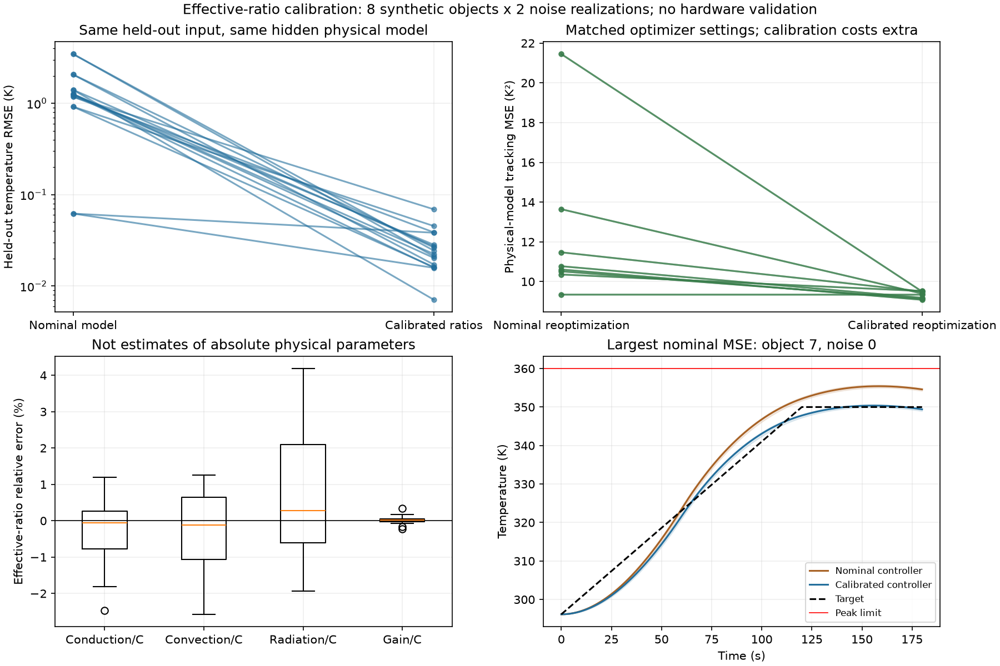

# 第四阶段：有效参数比值校准与留出工艺验证

日期：2026-09-24。性质：合成、同结构模型中的经典参数辨识与控制研究；没有硬件测量、真实参数估计或工业安全验证。

## 结论

**先消除共同尺度不可辨识性，再用少量温度观测校准有效比值，在本轮合成条件下确实改善了留出预测和工艺可行性。**

- 新8个对象，每对象2个独立噪声实现，共16次拟合；16次拟合和16次校准模型上的重优化均报告收敛。
- 固定留出加热输入下，标称模型预测RMSE中位数1.2525K；校准模型为0.02341K，16对均下降。
- 相同优化器、初值、输入边界和最大预算下重新优化：标称方案4/8对象合格；校准方案在两个噪声实现下分别8/8合格，即16/16次合格。
- 标定/重优化付出额外观测与计算，不是等总成本的算法竞赛，不证明AI优于经典方法。
- 对流和辐射比值的局部残差响应仍近似共线。预测准确不等于所有有效比值同样可信，更不能宣称已恢复绝对物性。

## 为什么只拟合四个比值

上一阶段证明热容量C、导热K、对流h、发射率ε和吸收增益g同比例缩放会保持温度解不变。因此本轮只拟合归一化乘子：

`[k/c, h/c, e/c, g/c]`

字母小写指相对标称值的乘子。实现中热容量固定为标称值，仅是选择数学尺度，不是独立测量已知热容量。辐射的有效乘子可以超过1，**它不是物理发射率**；NIST常数和原始标称发射率保持不变。有效模型能量账本也是归一化量，真实热量只在物理评价模型中计算。

有效模型与对应物理模型的温度最大差9.08e-10K，解析Jacobian相对中心差分误差1.46e-10；标称比值全1与原标称模型一致。这些是数学/数值等价检查，不是物理验证。

## 固定的试验设计

| 项目 | 设置 |
|---|---|
| 隐藏物理对象 | 新Sobol种子20260925生成8个对象，5类物理乘子在[0.9,1.1]；不复用上一轮181例 |
| 标定指令 | 240秒、3区不同脉冲再共同加热和冷却；具体7个节点事先写入protocol.md |
| 观测 | 3个已知位置，每5秒采样，去掉初始点；48×3=144个温度值 |
| 噪声 | 每对象2个固定种子的独立高斯噪声实现，标准差0.1K |
| 拟合方法 | SciPy least_squares，TRF、有界、单一初值、max_nfev=40，实际有限差分求解另计数 |
| 拟合模型 | 48单元有效模型；观测生成端96单元物理模型 |
| 留出预测 | 第二阶段固定180秒工艺指令，从未作为标定数据；拟合冻结后再评分 |
| 控制对照 | 标称和校准模型均24单元、SLSQP(maxiter=40)、同初值/目标/约束重新优化 |
| 真实评价 | 相同对象96单元、0.25秒采样、严格容差，对两种控制输入分别评价 |
| 输入安全边界 | 两种优化均将指令上限和变化率除以1.1，覆盖预设吸收增益上界 |

每次拟合只使用一份144点带噪观测，不把两次噪声实现合并成288点。两次噪声对应同一个物理对象，不是16台独立设备。所有范围、传感器位置和噪声性质都是研究设定，不是制造公差或真实传感器规格。

拟合函数只接收观测时刻、带噪温度和输出目录，不接收真实物理参数或验证输出；每次fit.json在留出验证前保存并冻结哈希。真实比值只在拟合后计算参数误差。没有根据留出结果改初值、调范围、增加迭代或重拟合。

## 留出预测结果

同一对象、同一固定留出输入、同一96单元评价场。下表噪声0/1分别对应两次独立拟合：

| 对象 | 标称预测RMSE | 校准预测RMSE：噪声0 | 校准预测RMSE：噪声1 |
|---|---:|---:|---:|
| 0 | 1.40280 K | 0.02723 K | 0.00708 K |
| 1 | 1.24349 K | 0.01588 K | 0.02832 K |
| 2 | 0.06210 K | 0.03834 K | 0.01583 K |
| 3 | 2.06141 K | 0.01718 K | 0.02636 K |
| 4 | 1.17789 K | 0.06912 K | 0.03865 K |
| 5 | 0.91754 K | 0.01611 K | 0.04533 K |
| 6 | 1.26146 K | 0.02242 K | 0.02032 K |
| 7 | 3.45639 K | 0.02113 K | 0.02440 K |

标称中位数按8个对象计算，校准中位数按16个对象/噪声组合计算；标称数值不会因为复制两次变成16个独立证据。训练残差RMSE范围0.08596–0.10758K，留出预测RMSE范围0.00708–0.06912K，二者不要混为一项指标。

预测误差小于单个观测的0.1K噪声标准差并不矛盾：拟合使用144个观测及正确的函数形式。这也是一个乐观条件，不能据此推广到存在传感器偏置或模型结构错误的情况。

## 校准后重新优化是否有用

控制目标与要求不变：峰温≤360K、最大空间温差≤12K、末态均温348–352K；真实吸收功率≤1W且变化率≤0.015W/s。

| 对象 | 标称重优化MSE | 校准重优化MSE：噪声0/1 | 标称末态均温 | 校准末态均温：噪声0/1 |
|---|---:|---:|---:|---:|
| 0 | 11.4709 K² | 9.5040 / 9.5035 K² | 351.9172 K | 349.4183 / 349.4040 K |
| 1 | 10.6063 K² | 9.0811 / 9.0816 K² | 349.5276 K | 349.3380 / 349.3926 K |
| 2 | 9.3424 K² | 9.3400 / 9.3388 K² | 349.3322 K | 349.3497 / 349.3583 K |
| 3 | 13.6422 K² | 9.3946 / 9.3950 K² | 346.9000 K | 349.3586 / 349.3477 K |
| 4 | 10.5143 K² | 9.1366 / 9.1331 K² | 347.0251 K | 349.4466 / 349.4132 K |
| 5 | 10.3549 K² | 9.5211 / 9.5230 K² | 349.0810 K | 349.4417 / 349.4646 K |
| 6 | 10.7716 K² | 9.1821 / 9.1819 K² | 347.0734 K | 349.3158 / 349.3814 K |
| 7 | 21.4507 K² | 9.4967 / 9.4969 K² | 354.5908 K | 349.4175 / 349.4042 K |

16对真实模型评价的MSE都下降，但对象2原本接近标称，收益很小。这不是所有对象都需要校准或收益相同的证据。

标称方案不合格的是对象3/4/6的末态不足、对象7的末态过高。校准方案全部采样点满足约束：末态均温范围349.3158–349.4646K，全部运行最大峰温350.7455K，最大空间温差1.3464K。最小温度约束裕量约1.3158K。

这里的“真实模型”仅指生成数据的隐藏物理参数模型，不是真实设备。标称模型和校准模型都重新优化，避免把重新优化本身误归因于校准；然而校准有额外观测资源，不能称为等总预算比较。

## 有效比值仍有不同可信度

在可查看合成真值的评价端，16次拟合的有效乘子误差为：

| 比值 | 绝对相对误差中位数 | 最大绝对相对误差 |
|---|---:|---:|
| 导热/热容量 | 0.476% | 2.463% |
| 对流/热容量 | 0.921% | 2.573% |
| 辐射/热容量 | 1.090% | 4.186% |
| 吸收增益/热容量 | 0.0545% | 0.3415% |

所有拟合均未被优化器标为活跃边界。白化残差Jacobian的局部条件数范围54.68–63.25；对流列与辐射列的余弦相似度0.9902–0.9921，意味着二者对这些观测的影响高度相似。

该诊断不是参数置信区间，也不能把一个条件数当作充分的可辨识性证明。它解释了为何辐射/对流误差相对较大，而温度预测仍可准确：参数误差可能相互补偿。绝对尺度不可辨识问题仍然存在，只是没有再试图估计它。

## 成本

- 每次校准：1条240秒模型时间的试验、144个观测。这里没有运行硬件240秒；计算机在加速模拟。
- 16次拟合共610次实际模型求解，包含有限差分Jacobian调用，累计74.66秒；单次约3.59–6.03秒。
- 16次校准后重优化共2179次模型求解，累计171.90秒；单次约7.31–12.26秒。
- 标称模型相同，只重优化一次：13次求解、约1.11秒；它使用之前已优化的轨迹作共同初值，因此较快收敛。
- 主实验总墙钟约256.77秒，另有后续验收与绘图开销。比较方法的最大预算相同，实际调用数与总成本不同，不能声称等成本。
- 以上为本机单次计时，非跨硬件性能保证；无需新增依赖、GPU、付费算力或大模型。

## 复核与警告

- 预注册的对象0、7噪声0做48→96单元标定预测复核，最大传感器差0.004463K，小于0.02K门槛。
- 两项对应控制用192单元、0.0625秒采样复核，最大温度类指标变化0.001148K，无合格判定翻转。这不是对所有对象连续时空约束的证明。
- 保存的全温度场可独立重算MSE、极值和约束；真实功率精确积分、独立对流/辐射积分与储热余额通过。
- 全部16个最终拟合预测重放与保存残差一致（本机最大差为0K），观测噪声可按种子完全重建，对象0/7干净观测也已独立重跑生成。
- 主实验出现1条SciPy BDF `invalid value encountered in subtract` RuntimeWarning。日志保留，未通过屏蔽警告“修复”；没有NaN结果或求解失败，最终拟合预测重放时未再次出现警告。根因没有得到独立确定，不宣称所有中间求解已无数值风险，未来换积分器或做独立交叉验证仍有价值。

SciPy官方文档说明least_squares的nfev不包含数值Jacobian估计的调用；本实验独立记录actual_solver_calls，未只用优化器nfev低报成本。文档快照与来源见sources/。

## 结果的适用边界

1. 数据生成器和拟合模型具有相同的物理结构，只改变参数和网格，因此较实际工程乐观。
2. 已知几何、传感器位置、初始温度和环境温度；噪声没有漂移、偏置、时间相关性或传感器动态。
3. 每个对象都单独做了校准；留出是该对象的新输入轨迹，不是一个模型零样本泛化到完全没校准的新设备。
4. 只有8个对象和每对象2个噪声实现，不报告真实可靠性、统计显著性或工程故障概率。
5. 两方法使用同约束/初值/优化器，但校准额外用了观测与拟合；未与鲁棒优化、PI/MPC、自适应反馈或其他辨识方法比较。
6. 没有真实设备、实际材料参数、工业数据或物理有效性审查，不能据此承诺产品交付。

## 下一步判断

“先校准，再优化”在这个有辨识约束的合成场景上得到初步正向证据，值得继续检验。但下一步不是增加拟合参数或模型规模，而是**引入拟合模型不知道的偏差**，例如传感器偏置/时滞或不同的散热分布，检查系统能否发现自己不可信。

如果模型结构错了仍给出很漂亮的拟合分数，真正有价值的功能应是报告不确定性、拒绝过度承诺或建议额外辨别试验，而不是输出更自信的功率方案。此类新实验需另固定协议；本轮未开展。

执行方法、阶段断点和证据路径见RUNBOOK.md。前三阶段产物保持不变。
