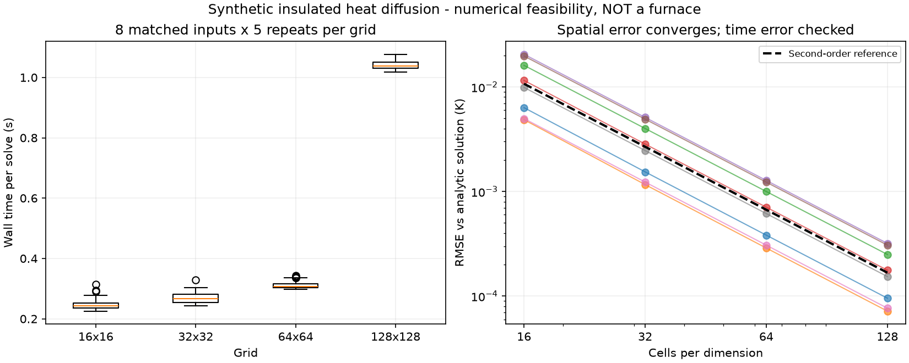

# 第一阶段复现结果：数值链路通过，暂不扩建平台

日期：2026-09-24。所有数字来自本目录实际执行结果；不代表北方华创、任何真实设备或生产工况。

## 结论

**上游软件能运行，热方程数值解得到解析验证，粗细网格之间确有成本/误差权衡。** 但当前问题只是绝热、无热源的扩散，不能据此证明加热轨迹优化有用，更不能宣称 AI 提效或设备可用。

本阶段决定：保留这套验证与计时基础，不把它包装成通用 ChamberBench，也不启动大模型训练、云平台或排行榜。若继续，下一项有价值的工作应是有公开物理依据的加热边界/辐射模型，而不是人为拖慢当前求解器。

## 1. 实际完成了什么

| 项目 | 结果 | 证据 |
|---|---|---|
| 隔离环境 | Python 3.12.8、py-pde 0.59.0、BoTorch 0.18.1、PyTorch 2.8.0+cpu；39 个依赖已锁定 | requirements.lock、results/environment.json |
| 源码固定 | py-pde 09b7354c4732646db9de2b4f24c334d776fc45db；BoTorch cd0249c60b2a81af0d91b5e7d462ef6f574fceec | upstream/manifest.json |
| 原生热方程 | 64×64 上游随机扩散示例运行、质量守恒及波动下降检查通过；保存热场图 | logs/upstream-heat.log、results/upstream-heat.png |
| 原生测试 | 3 项 Dirichlet/Neumann 边界测试按上游原断言通过 | results/upstream-heat.json |
| 原生多保真教程 | 13 个代码单元通过，两条流程各 2 轮、每轮 2 个候选；推荐在目标 fidelity=1 上得到有限函数值 | logs/upstream-botorch.log、results/upstream-botorch.json |
| 网格测量 | 8 个输入 × 4 档网格 × 5 次 = 160 条有效正式记录 | results/thermal-raw.jsonl |
| 数值复核 | 连续解析解、半离散精确解、均值守恒、最大值原理、空间收敛及时间容差复核通过 | results/thermal-summary.json、logs/verification.log |

BoTorch 采用其原生 SMOKE_TEST 模式，不是完整论文复现。教程总代码执行约 11.708 s；这里是单次软件运行耗时，不是算法效率结论。其 MFKG/EI 对照的初始数据与查询成本不同，未据此比较优劣。

## 2. 热模型：同一问题，只改变网格

- 数学问题：二维热扩散，1 m × 1 m 绝热区域，无热源，热扩散率 0.01 m²/s，演化 1 s；温差加上 300 K 可还原绝对温度。
- 8 组固定种子初始场，每组由相同的三个余弦模态构成。参数都是公开的研究设定，不是硅片或炉腔材料数据。
- 同一 py-pde NumPy 后端、SciPy RK45、rtol=1e-10、atol=1e-11；时间积分器自适应步数随网格改变，未固定每档时间步。
- 每档先预热，再随机交错执行正式测量；CPU 单线程。计时包括初始化和求解，不含导入、误差计算、日志和绘图。
- 主机为 Intel Core i7-10700，共享主机的其他活动无法排除；统计是初步工程测量，不是跨硬件性能保证。

### 实测表

每行 40 次求解，来自 8 个输入各重复 5 次。RMSE 是求解末态相对于同一位置连续解析解的均方根误差。

| 网格 | 墙钟中位数 | 墙钟四分位区间 | RMSE 中位数 | 全部工况最大点误差 |
|---|---:|---:|---:|---:|
| 16×16 | 0.2422 s | 0.2353–0.2529 s | 0.010720 K | 0.043958 K |
| 32×32 | 0.2675 s | 0.2545–0.2808 s | 0.002653 K | 0.011493 K |
| 64×64 | 0.3062 s | 0.3025–0.3159 s | 0.000662 K | 0.002905 K |
| 128×128 | 1.0377 s | 1.0313–1.0511 s | 0.000165 K | 0.000728 K |

对应同工况、同重复编号的 128²/16² 耗时比中位数为 **4.2872**，样本范围 **3.2836–4.7034**。这表示不同数值精度的查询成本差，不是 AI 加速比，也不是相同精度下的求解器性能比较。

四档网格的空间 RMSE 收敛阶在 **2.0004–2.0618** 之间。借助半离散精确解检查，正式测量最大时间积分误差为 **1.423×10⁻¹⁰ K**，远小于空间误差。

第一工况额外使用 100 倍严格时间容差计算 128² 和 256²，RMSE 分别为 **9.5512×10⁻⁵ K**、**2.3868×10⁻⁵ K**，收敛阶 **2.0006**。256² 的单次耗时约 **7.080 s**；这只是一项额外精化验证，不能与每行 40 次的中位数混同。



## 3. 一个需要谨慎解释的排序现象

在 8 个初始场上，粗细网格对末态温度标准差的 Spearman 相关系数是 **0.97619**，28 对工况中有 1 对次序不同：

| 工况索引 | 16² 标准差 | 128² 标准差 |
|---|---:|---:|
| 1 | 2.531713 K | 2.530009 K |
| 2 | 2.533670 K | 2.528906 K |

这个现象仅说明接近的候选输出可能因离散误差发生排序变化；差值很小、样本只有 8 个，也没有实际优化过程或工程约束，**不能据此宣称已经构造出困难的工业优化基准**。

## 4. 发现并修正的问题

### py-pde 求解器 API

初次调用将 ScipySolver 实例传给 equation.solve，0.59.0 明确抛出 `solver must be a class not an instance`。已按安装版本接口改为传类及求解参数，保留失败日志；同一预检随后通过，实验方程、输入和验收阈值未改变。

### 网格相关的统计量语义

复核发现 `ScalarField.fluctuations` 是体积缩放后的波动，不是普通温度标准差。已单独构造标准差恒为 0.5 的余弦场复现：16² 与 32² 的 fluctuations 分别为 0.03125、0.015625。

测量脚本改用 `np.std(result.data)`，并增加相对于半离散精确解的标准差检查。验收脚本进一步独立计算模态方差，防止体积缩放错误再次通过。

首轮 160 次数据与早期预检保存在 `results/attempt-1/`，未删除、未静默修写。修正后按原协议完整重跑 160 次；本报告只引用后一次正式结果，未拼接两轮计时。

### 上游 BoTorch 警告

原生教程使用 qExpectedImprovement，运行时产生 NumericsWarning，建议改用 qLogExpectedImprovement。为保持上游行为本轮未改教程；未来正式方法比较不能忽略此警告。原生推荐前未用最后一批新观测重拟合的行为也保留，并在执行结果中标注。

## 5. 对立项的影响

### 已有证据支持

1. 无需企业数据即可搭建一个可复算的热方程数值验证环境。
2. 可以固定方程、输入和误差标准，量化不同网格的实际成本。
3. 现成多保真库在当前 CPU 环境能够运行，无需先重写优化基础设施。
4. 需要把工程指标定义纳入测试；仅“仿真没报错”不够。

### 仍然不支持

1. 当前问题没有热源、控制输入或非线性辐射，距离 RTP 加热任务仍有明显差距。
2. 没有在同一热任务上运行优化器，因此没有“多保真比单保真省钱”的证据。
3. 128² 查询约 1 s，成本差只有约 4.29 倍；这不足以直接论证部署复杂多保真策略的收益。不能拿另一个 Hartmann 教程的耗时算热任务加速比。
4. 未比较更适合该线性问题的隐式、谱或降阶解法，不能把当前 RK45 路径当成最佳经典基线。
5. 没有材料/边界实测、实验室校准或企业需求，不能声称工业适用、可商业交付或值得大规模投入。

### 后续优先级

**先补一个有公开方程、参数出处、受限加热输入和非线性边界的单场景，再考虑优化；暂不扩成平台。** 新场景仍需先通过解析退化情况、能量平衡与空间/时间收敛，且用合理经典求解器/优化方法作基线。

后续若模型适用性得不到外部热工/数值专家审查，应保持科学计算演示定位。若计入全部开销后多保真无收益，保留负结果，不人为增加延迟或挑选输入制造优势。

## 6. 验证与重跑

运行日志关键结果：

```text
PASS original heat example and 3 selected upstream tests
PASS 13 upstream notebook code cells; 2 target-fidelity recommendations
PASS 160 unique paired measurements, fixed inputs and time-error/conservation gates
PASS temperature standard deviation against independently evaluated modal variance
PASS spatial convergence and 100x tighter time tolerances at 128/256
PASS measurement protocol unchanged since preregistration
```

从本目录执行 `.venv/bin/python scripts/verify_results.py` 可复查证据与产物哈希。完整环境和重新运行说明见 RUNBOOK.md；已有结果时 thermal_probe.py 会按配置断点续跑，若要重测全部时间，应先归档旧记录。

两个结果图均已实际生成并视觉检查。本轮没有浏览器页面、API 服务、硬件实验或付费计算；未修改上级原有会话修复文件。
