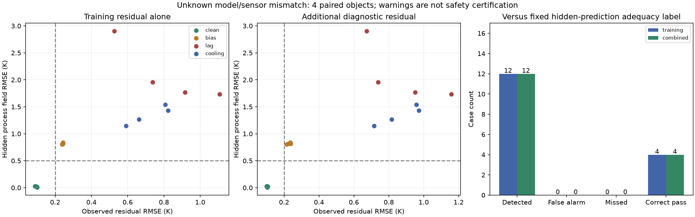

# 第五阶段：未知偏差告警的受控实验

日期：2026-09-24。本轮是16个合成配对案例，不是工业异常检测验证。

## 结论

**拟合器收敛不是模型可信的证据。** 16次原校准器拟合全部报告收敛，但其中12个含未知偏差的案例，在完全未参与拟合/告警的工艺输入上出现0.80–2.91K的全场预测RMSE。

事先固定的0.2K残差告警识别了这12个问题；4个clean对照未误报。但是，**额外诊断试验并未增加检出数量**：只看标定残差就能识别全部12例。保留这个零增益结果，不调阈值、不改偏差幅度追求漂亮对照。

这组偏差在观测上较明显，不能据此宣称一般情况下无误报/漏报，更不能将“不告警”解释为可信或安全。

## 做了哪些改动

- 在独立model_mismatch目录增加配对数据生成、传感器误差、残差告警与独立核验脚本。
- 原radiation/model.py及calibration/effective.py、fit_and_control.py完全未改；没有新增依赖、AI或控制重优化。
- 先保存协议、固定工况和文件哈希，然后生成带噪观测，使用原fit_ratios拟合。
- 拟合结果先冻结；独立诊断残差产生的告警再次冻结后，才运行隐藏物理评价。告警函数只接受残差和拟合状态，不读取情形名称或真实温度。

## 配对设计

4个新Sobol对象，5类物理参数仍在原研究范围±10%；每对象有以下4种情形，共16次拟合：

| 情形 | 唯一新增变化 | 拟合器是否知道 |
|---|---|---|
| clean | 无 | 不额外提供情形标签 |
| bias | 所有传感器读数+0.5K | 不知道偏置 |
| lag | 所有传感器一阶时滞8s | 仍假设瞬时读数 |
| cooling | 实际对流空间变化系数0.6 | 仍固定为0.3 |

偏差不叠加；同对象不同情形的标定噪声数组完全相同，诊断噪声也完全相同，标准差均为0.1K；标定与诊断噪声独立。bias/lag只改变观测，不改变物理温度场。cooling改变真实散热分布。

标定是上一阶段240s分区脉冲，3传感器每5s读取一次，去掉初始点，144个数据。诊断是另一条预先固定的240s分区加热/冷却轨迹，再增加144个观测。两条试验均有成本，诊断数据没有回流拟合。

每次拟合保留原算法、边界、初值和max_nfev=40；没有因为遇到错误情形而放宽边界。9个偏差拟合触及至少一个比值边界（bias 1例、lag 4例、cooling 4例），但边界命中不加入本轮预设告警规则，以免事后修改判据。

## 预设判据

标定规则：拟合不收敛，或残差RMSE>0.2K，或任一传感器残差均值绝对值>0.2K。

组合规则：标定规则触发，或独立诊断残差RMSE>0.2K，或任一诊断传感器残差均值绝对值>0.2K。

隐藏评价标签：固定180s工艺轨迹下，全温度场预测RMSE>0.5K或末态均温绝对误差>1K，则标为“预测不足”。标签不参与拟合或告警。

所有阈值是研究设定。0.2K不是统计假阳性率校准结果，0.5K/1K不是工艺安全要求。不能混用“观测残差超标”“隐藏预测不足”和“实际控制器不安全”。图中虚线只显示RMSE阈值，完整规则还检查均值残差、拟合状态和末态误差。

## 结果

| 情形 | 案例数 | 标定残差RMSE范围 | 独立诊断残差RMSE范围 | 隐藏全场预测RMSE范围 | 标定告警 / 组合告警 |
|---|---:|---:|---:|---:|---:|
| clean | 4 | 0.0885–0.1011K | 0.0998–0.1076K | 0.0069–0.0287K | 0/4 / 0/4 |
| bias | 4 | 0.2381–0.2441K | 0.2146–0.2381K | 0.8027–0.8390K | 4/4 / 4/4 |
| lag | 4 | 0.5264–1.1077K | 0.6738–1.1580K | 1.7343–2.9055K | 4/4 / 4/4 |
| cooling | 4 | 0.5910–0.8232K | 0.7149–0.9730K | 1.1487–1.5404K | 4/4 / 4/4 |

相对于预设隐藏预测标签的计数：

| 规则 | 检出TP | 误报FP | 漏报FN | 正确放行TN |
|---|---:|---:|---:|---:|
| 标定残差 | 12 | 0 | 0 | 4 |
| 标定+诊断 | 12 | 0 | 0 | 4 |

这些是16个固定案例的计数，不是未知故障分布下的精确率/召回率保证。12项物理/观测偏差恰好都导致本轮隐藏预测不足，实际场景中偏差存在并不一定需要告警，偏差缺失也不保证预测准确。

最重要的否定结果：额外144个诊断观测，在这个设计上新增检出0例、新增误报0例。当前证据不足以将额外诊断做成必选步骤或宣传其收益。



## 时滞与数值核验

- 时滞方程为tau*y'=T_sensor−y，tau=8s。真实传感器输入在0.25s网格之间线性插值，逐段精确积分，再5s采样。
- 恒温、线性斜坡解析检查通过，门槛1e-9K。
- 对象0的时滞观测另用scipy.signal.lsim独立实现验证；对所有对象0情形的标定/诊断观测重建，最大差约7.39e-13K。
- 时滞输入物理输出加密到0.0625s后，观测最大变化4.99e-5K，小于0.001K门槛。
- 对象0四种情形的隐藏评价加密到192单元/0.0625s，RMSE及末态误差最大变化0.000717K，小于0.01K；无预测标签翻转。
- 所有物理生成检查了功率幅值/变化率、有限正温度、能量余额、功率节点精确积分和独立热流时间积分。
- 检查器从保存数组重算残差、告警与隐藏预测评分，独立统计TP/FP/FN/TN；保存拟合与告警哈希未改变。

物理精化使用同一个求解器，不能叫独立物理验证；lsim仅验证传感器动态计算，不证明真实传感器具有8s时滞。全空间温度RMSE以离散时空样本定义，不构成连续时间误差上界。

## 成本和文件

16次拟合共707次实际模型求解（含有限差分Jacobian），累计拟合墙钟88.36秒；主进程含观测生成、诊断、隐藏评价和精化共100.06秒，另有独立核验与绘图开销。

每案例需要240秒模型时间的标定试验；组合规则额外需要240秒模型时间诊断试验。这些在本机加速模拟，没有真实运行480秒的设备试验，也没有以延时伪造计算成本。

- `results/config.json`：固定对象、指令、协议/模型/拟合器哈希。
- `results/object-N-S/fit.json`和`fit-calls.jsonl`：每次拟合结果、停止状态和实际调用。
- `training.npz`、`diagnostic.npz`：失真后的无噪读数、配对噪声、最终观测及预测。
- `alarm.json`：先于隐藏评分冻结的告警与原因。
- `evaluation.npz`：完全未参与拟合/告警的工艺输入下，真实参数生成场与拟合模型预测场。
- `case.json`：原始误差、能量检查、告警、精化结果。
- `logs/experiment.log`、`logs/verification.log`：运行和验收证据。

## 重跑

在本目录执行：

```sh
set -o pipefail
timeout 600s ../feasibility/.venv/bin/python -u experiment.py 2>&1 | tee logs/experiment-rerun.log
../feasibility/.venv/bin/python -u verify.py 2>&1 | tee logs/verification-rerun.log
```

主实验已经完成时不重复拟合。已完成案例可复用；未完成的原拟合阶段有调用日志时会拒绝静默重启，需要显式归档后继续。若配置/源码哈希改变须归档本次结果，不能混跑不同版本。模型方程和告警规则均在本轮运行前固定。

## 下一步，不把简单实验包装成可靠检测器

1. 本轮支持加入最基本的残差检查，而不是仅信任优化器success。但工程上应返回“需要复核”，不能自动判安全。
2. 下一步应独立预注册偏差幅度/激励范围测试，找到残差尚小而隐藏预测已经不达标的反例；不能在本轮阈值上反复调参后宣称泛化。
3. 同一个系统偏置也会污染独立诊断传感器，额外轨迹未必能发现；需要检查测量参照、独立传感器或初态信息的价值。
4. 后续必须加入更多噪声实现、多个偏差幅度及组合，同时明确额外诊断试验成本。当前4个对象和单幅度测试不支持普适检出能力。
5. 校准/诊断基线全部是经典数学方法，尚无AI增益或企业需求证据。项目继续完善，当前只是一个有据可查的研究工作台，不是完成的工业产品。
