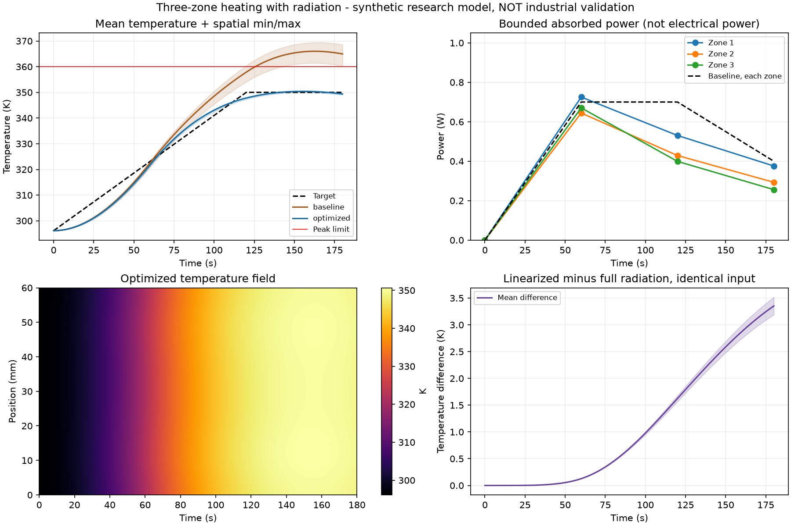

# 第二阶段：受限三分区加热与非线性辐射

日期：2026-09-24。性质：公开物理方程上的合成研究案例，未经实物或企业验证。

## 结论

已经从第一阶段的无源扩散，推进到**空间分布加热、非线性辐射损失、受限功率轨迹与经典优化**。预设数值检查通过，一次SLSQP优化得到在细网格上可行的方案。

最有研究意义的现象是：同一输入下，只把辐射线性化，就产生约3.35 K的末态均温差，并改变末态合格判定。但这说明的是模型形式误差，不是AI收益，也不是实物误差。

同时，主优化在当前CPU上只用了约6.80秒；此问题尚不需要复杂多保真优化来节省计算。应保留其作为偏差与约束验证案例，而不是立即建设通用平台或添加Agent。

## 公开依据及适用范围

1. [TCLab动态建模教学页](https://apmonitor.com/pdc/index.php/Main/ArduinoModeling)：能量平衡、对流和四次方辐射项；质量4g、比热500 J/(kg K)、暴露面积0.0012m²、对流系数10 W/(m² K)、发射率0.9、环境296.15K。
2. [NIST Stefan–Boltzmann常数](https://physics.nist.gov/cgi-bin/cuu/Value?sigma)：使用5.670374419×10⁻⁸ W/(m² K⁴)。

这不是复现实际TCLab硬件，也不是把其参数冒充半导体材料。教学页的集总模型被扩展为研究用一维分布模型；长度、等效轴向导热、加热分布、对流空间变化及升温目标都是协议中明示的研究设定。

采用灰体对大等温环境、视角因子为1的近似；没有模拟灯光传输、腔壁温度、硅片光谱发射率、真空、化学反应或传感器。功率是**已吸收功率，不是加热器电功率**，总暴露面积只计算一次。

来源文本、URL与SHA-256保存在sources/；实施前固定协议和哈希。没有新增依赖，使用第一阶段虚拟环境中的NumPy/SciPy/Matplotlib。

## 任务与算法

- 初始温度296.15K，目标在120秒内升到350K，保持到180秒。
- 三个加热区各0–1W，功率节点0/60/120/180秒、节点间线性插值；初始零功率，变化率≤0.015W/s。
- 约束：采样最高温度≤360K、全过程最大空间温差≤12K、末态均温348–352K。
- 9个自由变量；目标为全空间温度相对于目标轨迹的时间平均MSE。
- 主优化：24单元、1秒输出采样，SLSQP，最多40次迭代；只运行了一次，无阈值放宽或重新挑选初始值。
- 对照输入是每区[0,0.7,0.7,0.4]W的预设未优化轨迹，不是已经调好的PID/MPC。优化过程的中间候选可以不可行，因为只在离线仿真中搜索，不接触设备。
- 两条输入统一用96单元、0.25秒采样和严格时间容差复核。额外0.0625秒采样检查也通过，但仍不是连续空间/时间的约束证明。

## 实际结果

| 指标 | 未优化参考轨迹 | SLSQP轨迹 | 验收要求 |
|---|---:|---:|---|
| 跟踪MSE | 89.8373 K² | 9.3481 K² | 优化目标 |
| 最高温度 | 369.4532 K | 350.6741 K | ≤360 K |
| 最大空间温差 | 8.3131 K | 1.2148 K | ≤12 K |
| 末态平均温度 | 364.9538 K | 349.3798 K | 348–352 K |
| 末态空间标准差 | 2.8811 K | 0.1438 K | 辅助指标 |
| 吸收热量 | 288.0000 J | 231.6094 J | 辅助指标 |
| 采样点可行性 | 不可行 | 可行 | 功率、变化率、温度同时满足 |

同任务、同初始条件、同细网格和评价标准下，MSE比预设未优化轨迹下降89.59%。**这不是AI对比经典方法，也不是等优化预算的算法竞赛**，只是同一输入参数化下的优化前后结果。没有全局最优保证，没有多随机初值统计，也没有跨工况泛化证明。

优化器18次迭代、191次实际模型求解，墙钟6.7975秒。96单元严格复核的单次求解：参考轨迹0.0707秒、优化轨迹0.0699秒。它们是单次计时，不构成求解器性能排名；主优化耗时另包含优化器、约束处理与日志等开销。

最终各区吸收功率（W）：

| 时间 | 区1 | 区2 | 区3 |
|---|---:|---:|---:|
| 0 s | 0 | 0 | 0 |
| 60 s | 0.72510 | 0.64429 | 0.67024 |
| 120 s | 0.53039 | 0.42874 | 0.39900 |
| 180 s | 0.37575 | 0.29309 | 0.25596 |



## 控制变量的辐射对照

固定同一优化输入、96单元网格、初始状态、时间容差、采样时刻及其他参数，只改变辐射项：

- 完整模型：eps sigma (T⁴ − Ta⁴)。
- 线性模型：4 eps sigma Ta³ (T − Ta)。

| 指标 | 完整辐射 | 环境温度附近线性化 |
|---|---:|---:|
| 末态均温 | 349.3798 K | 352.7325 K |
| 辐射散热积分 | 50.1318 J | 41.0416 J |
| 末态均温限制 | 满足 | 超过352 K上限 |

两模型最大逐点温差3.5166K，末态均温差3.3526K。线性化在升温后低估损失，从而预测更高温度，方向与T⁴凸性一致。

这里**不是**“粗模型推荐的方案在实物中失败”，也不是“线性模型优化后交给完整模型验证”——本轮没有进行第二次优化。它只证明同输入的模型形式差异足以改变此研究任务的可行性判定。下一步若研究优化迁移，需另固定试验协议，不能从本表直接推出结论。

## 数值与能量证据

| 检查 | 实测 | 预设门槛 |
|---|---:|---:|
| 无源环境平衡误差 | 0 K | <1e-7 K |
| 无损均匀加热解析误差 | 5.68e-14 K | <1e-5 K |
| 解析导热退化例空间收敛阶 | 1.99947 / 1.99987 / 1.99997 | 1.7–2.3 |
| 48/96单元最大均温差 | 1.78e-5 K | <0.1 K |
| 48/96单元最大标准差差 | 6.25e-4 K | <0.1 K |
| 100倍严格时间容差引起场差 | 7.91e-6 K | <0.001 K |
| 解析Jacobian相对中心差分误差 | 1.71e-10 | <1e-7 |
| 优化输入独立热流积分能量余额 | 8.99e-6 J | <0.1 J |

优化方案能量账本：吸收231.609364 J − 对流75.017879 J − 辐射50.131827 J = 储热106.459658 J。内部积分状态余额约1.4e-13 J；由于内部状态共用ODE，不能只凭它宣称独立验证。另用功率轨迹精确积分及保存温度重新计算热流梯形积分，得到上述8.99e-6 J余额。

优化输出从0.25秒细化到0.0625秒采样后，峰值变化2.26e-5 K，MSE变化−5.64e-5 K²，所有采样限制仍满足。参考模型是同一方程的精细数值解，不是实物真值；尚无独立求解器交叉验证。

## 重跑与断点

在本目录执行：

```sh
set -o pipefail
../feasibility/.venv/bin/python -u check_model.py 2>&1 | tee logs/model-checks-rerun.log
../feasibility/.venv/bin/python -u verify_and_plot.py 2>&1 | tee logs/verification-rerun.log
```

重新主优化：先归档本轮的experiment*.json、optimizer*.json、optimization-calls.jsonl及相关输出，再运行：

```sh
timeout 240s ../feasibility/.venv/bin/python -u experiment.py 2>&1 | tee logs/experiment-rerun.log
```

已有主优化记录时脚本拒绝覆盖，防止静默挑选结果。每次模型调用保存输入与指标，每次迭代保存当前候选；这些便于故障审查，**不是SLSQP内部状态的精确断点恢复**。本次主优化在单进程内完成。

## 下一步判断

1. **保留**：公开来源、量纲、守恒、离散误差、约束复核组成的验证链；它比增加功能更重要。
2. **暂不做**：此小模型上的AI/多保真加速。经典优化已经只需数秒，不能人为扩大网格或加等待制造机会。
3. **值得进一步验证**：当发射率、散热系数或输入模型不准确时，方案是否仍合格，以及少量观测能否校准模型。这将从“已知模型下调功率”转向“模型不确定时如何做可靠决策”。
4. **仍然缺失**：实际材料与几何参数、模型适用性专家审查、硬件实测、真实工艺指标和企业需求。未获得这些证据前，只称合成研究案例，不称工业数字孪生或明星项目已立项。
