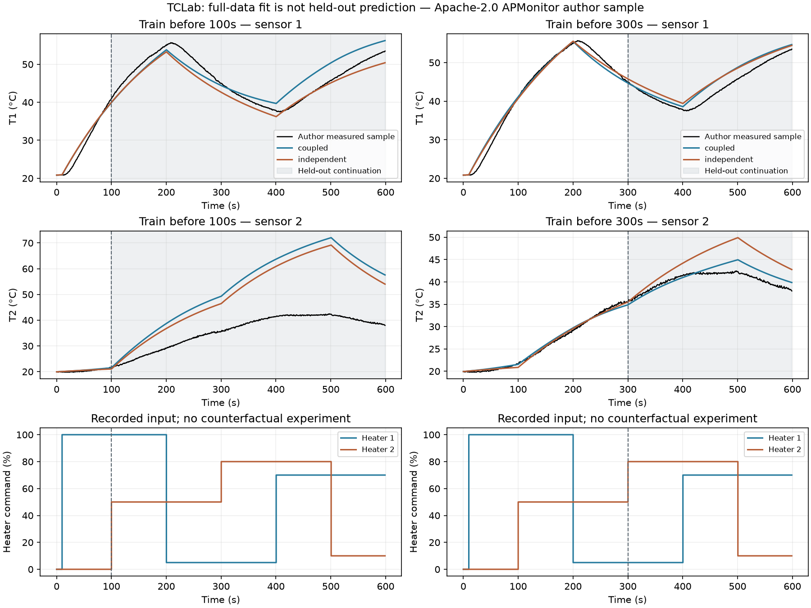

# 实测案例：拟合得更好，不一定更会预测下一段加热

本轮把APMonitor公开的双加热器TCLab样例实际跑进项目，完成作者原生程序复现和两个模型的时间留出对照。**不再使用自己生成的温度作为观测目标**，但数据仍是作者提供的实测样例，不是我们独立采集、审计或具有计量溯源的设备数据。

## 先看结论

1. 作者原脚本全量拟合能运行：相对摄氏读数平方和由54.1471降到1.36757，599行的样本内温度RMSE为1.2970°C。这个结果是样本内拟合，不是泛化证明。
2. 只用前100秒时，第二加热器没有输入，因此其增益根本无法从这段温度数据估计。两模型的训练RMSE都约1°C，后续预测却大幅失准。
3. 用前300秒拟合后，**独立模型训练RMSE更低（0.8629°C vs 1.0778°C），但耦合模型的后续预测RMSE更低（1.8865°C vs 3.7874°C）**。应看留出预测而不是仅看拟合曲线。
4. 这给出了一个有用的下一步测量判断：如果关注第二加热器增益，重复只激励第一加热器不能补足信息。应考虑对第二路做独立激励，而不是让优化器假装已经估计了它。

以上是同一历史试验的离线证据，**没有证明我们推荐的新试验比人工更好，也没有真实故障标签**。

## 数据来自哪里

- [固定提交的数据与原模型](https://github.com/APMonitor/arduino/tree/f36e65a70dd7122d1829883899e40e56bf6c4279/2_Regression/Energy_balance_MIMO/Python_minimize)
- [作者的双加热器实验说明](https://apmonitor.com/pdc/index.php/Main/ArduinoEstimation2)
- 数据SHA-256：`10278caee2b095cca028e19acd9146157a75cdd8426e0490231de7a9def8ebdc`。
- 599行、7列，时间0–598.9002秒；实际采样间隔0.9903–1.0214秒，不能只用行号当严格等间隔时间。
- Q1/Q2是百分比指令，T1/T2是°C。T1范围20.8–55.7°C，T2范围19.77–42.46°C。两列23°C设定值不是实测环境温度。
- 输入在索引10/100/200/300/400/500切换，与作者网页的能量模型采集示例一致；代码读温度后施加该行输入，所以预测下一行采用前一行的输入。

原始数据和mimo_fit.py保持不变，Apache-2.0许可附在upstream/LICENSE；精确版本/路径/哈希见upstream/manifest.json。没有恢复此前为公开版移除的论文或网页全文。归属和本地模型适配说明见ATTRIBUTION.md。

## 我们怎样比较

两种模型都使用作者的固定参数：每节点质量4g、比热500J/(kg K)、外表面积0.001m²、交换面积0.0002m²、发射率0.9、环境23°C。

- **coupled**：保留节点间对流和辐射换热。U同时参与对环境和节点间的对流，不是一个可以单独辨识的自由耦合系数。
- **independent**：只去掉节点间对流/辐射交换，其余参数、初值、目标、边界和拟合预算相同。

两模型均拟合U、加热增益alpha1/alpha2；前100秒没有Q2激励时只拟合U/alpha1，并将alpha2维持作者默认值0.0075 W/%，明确标为假设而非估计值。

训练和验证在拟合前固定：

| 切分 | 训练数据 | 留出数据 |
|---|---|---|
| 100秒 | t<100，100行 | t≥100，499行 |
| 300秒 | t<300，300行 | t≥300，299行 |

各切分内使用相同数据、目标和数值方法比较两种结构。两切分的验证段不同，不能直接把它们的RMSE变化全部归因于多了某一项信息。验证从训练结束的**模型预测状态**继续，不用每一个实测温度重置；初始化只用第0行两个实测温度。

作者原脚本的全量拟合单独运行，之后没有用其全量最优参数替换早期拟合初值。我们的时间留出拟合用TRF最小二乘（最多100个nfev），初值和物理边界仍来自作者；实际有限差分模型调用完整计数。

## 结果表

| 训练截止 | 模型 | 训练总体RMSE | 留出总体RMSE | 留出T1 RMSE | 留出T2 RMSE |
|---|---|---:|---:|---:|---:|
| 100秒 | coupled | 1.0576°C | 13.5563°C | 3.0024°C | 18.9350°C |
| 100秒 | independent | 1.0893°C | 11.7199°C | 2.1788°C | 16.4306°C |
| 300秒 | coupled | 1.0778°C | 1.8865°C | 2.1912°C | 1.5219°C |
| 300秒 | independent | 0.8629°C | 3.7874°C | 2.3666°C | 4.8050°C |

**没有隐去不利结果**：100秒切分下，coupled验证误差比independent更大；不能说加了物理耦合就必然更好。未知第二路加热增益使用了未经早期数据验证的默认值，两模型都不适合据此放心预测第二路启动。

300秒切分时，independent在训练曲线上更好，却在后半段明显变差，尤其T2。我们可以说“此切分下耦合结构的后续预测更好”，但不能从一个历史序列推导普适模型排名或因果根因确认。

图中灰色部分是各切分自己的留出区间，T2子图纵轴不同，勿只凭线条视觉比较误差。输入图采用post阶梯，反映该行记录的输入作用于后续时间段。

## 前100秒究竟学不到什么

方程里第二路输入热量是`alpha2 × Q2`。当整个训练区间Q2=0时，改变alpha2不会改变任何温度输出，包括coupled模型。这是方程中的结构性缺信息，不是优化器不够强。

冻结早期拟合得到的U和alpha1，仅把alpha2改成作者允许区间的两个端点：

| 模型 | alpha2假设 | 训练曲线最大变化 | 后续总体RMSE |
|---|---:|---:|---:|
| coupled | 0.002 W/% | 0°C | 2.8681°C |
| coupled | 0.015 W/% | 0°C | 32.8125°C |
| independent | 0.002 W/% | 0°C | 4.6555°C |
| independent | 0.015 W/% | 0°C | 31.1855°C |

这些端点不是“我们优化出来的更好参数”，也不是置信区间，不能挑误差小的一端当作方法成果。它们说明：**相同训练拟合可以对应截然不同的后续预测**。早期两个活动参数的Jacobian满秩，不代表原来三个物理参数都可辨识。

## 当前不能过度解释的细节

- 前100秒数据里T2从19.93°C升到21.67°C，但作者假设环境为23°C。即使没有节点间耦合，T2也会向较高环境升温；不能仅凭“第二路关闭但温度上升”宣称已证明耦合。
- 前100秒两模型的alpha1都达到作者下边界；coupled的U也非常接近下边界。前300秒两模型U都达到下边界2 W/(m² K)。可能涉及边界、固定环境/其他参数、传感器或模型结构，本轮没有为了改善结果放宽范围。
- 初温T1=20.83°C、T2=19.93°C，不等于固定23°C环境；设定值不证明真实环境，不能擅自把初温差解释为零偏。
- 作者目标是相对于**摄氏读数**的平方残差，分母平移到K会改变权重；本轮保留它用于同条件拟合，同时额外报告RMSE/MAE。原日志名为SSE不代表未经加权的物理温差平方和。
- 原生拟合使用全部599行，获得U≈2.59136、alpha1≈0.00530806、alpha2≈0.00288701。它与早期拟合信息不同，不能放进同一个“泛化性能”排名。
- 这不是已标注散热故障/传感器故障数据，因此不直接沿用我们的旧两候选convection/offset分类标签。

## 给“下一次试验助手”的具体输入

本轮能给出一个**有条件、可解释的下一步任务**，而不是未经许可的设备命令：

> 如果你的目标包括估计第二加热器增益，而已有记录只有Q1激励，就需要第二路的独立输入变化（或独立的功率增益校准信息）。单纯增加Q1脉冲、重复记录温度，无法让这段模型中的alpha2变得可估计。

历史记录已经在约100秒后做了Q2输入；我们可用它验证“增加这类信息后能否拟合第二路响应”。但无法得知所有其他未做试验的实测结果，也不能证明我们会比作者的既定实验更省次数。

下一产品动作应是把“目标参数未受激励”作为数据接入时的提示，并让用户确认下一路允许输入；而不是把该数据硬塞进现有三分区模型或立即改名为半导体案例。

## 实际验证

- 作者原程序原样执行，打印初始目标54.1470507、最终1.3675682，优化成功；源代码和数据哈希未变。
- 新适配器与作者原生simulate在相同初始/拟合参数下全序列最大温差分别5.93e-5°C和8.03e-5°C，小于预设0.02°C门槛。
- 20组随机状态/输入/参数下，适配方程导数与直接提取的作者heat函数一致至预设1e-12以内。
- 4个独立训练拟合全部收敛，真实模型调用共245次（含差分），累计拟合约27.83秒；原生整段脚本约2.34秒。不同目标/求解路径不能用这两项耗时作算法排名。
- 全部留出指标从新预测数组复算；原始时间、掩码、冻结参数、前缀和无实测重置的连续预测均检查通过。
- 将时间积分容差收紧100倍，曲线最大变化约1.28e-13°C；模拟热量账本余额小于1.1e-12J。只是方程与数值检查，没有热流传感器测量用于实物能量验证。
- 11项测试通过，包含数据单位/时间、Q2未激励、初态与输入对齐、耦合能量抵消，以及篡改温度、切分掩码和冻结拟合被拒绝。
- 这11项新测试已纳入根scripts/check.py，使用原NumPy/SciPy双包环境执行完整仓库检查，总计90项通过；它不重新拟合原生脚本，Pandas/Matplotlib仅为专用重算与绘图环境所需。完整检查日志保存在本地output/tclab-study/repository-check.log。

图像已实际渲染检查；完整日志在logs/，原生与留出结果在results/locked-run/。环境冲突的失败尝试发生在拟合前，留在results/first-run及logs/failed-system-environment.log；隔离环境处理见EXECUTION_NOTES.md。

## 如何使用与引用

重算命令及输入边界见RUNBOOK.md；原始数据/代码的归属与许可证见ATTRIBUTION.md和upstream/LICENSE。本研究报告不能替代引用数据来源；原样使用或改编模型应保留APMonitor归属和Apache-2.0条款。

本轮没有推送新的提交、没有写入之前的冻结阶段，也没有从历史数据推断真实故障或工业收益。
