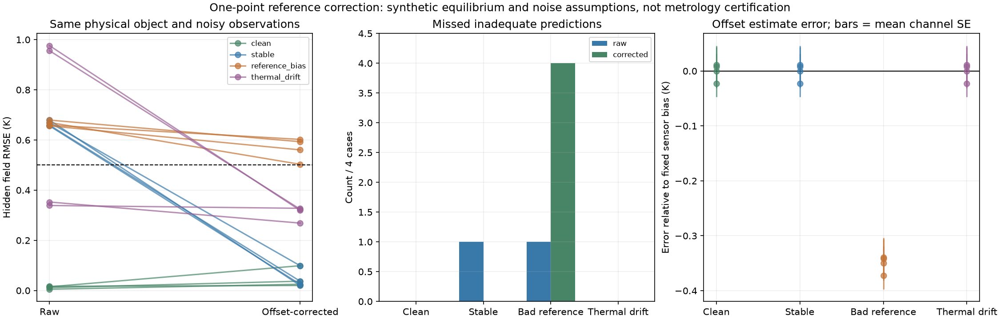

# 第七阶段：独立参考校正有效，但参考错误会制造假信心

日期：2026-09-24。性质：加热前参考测量的合成配对实验，不是实际传感器校准或计量认证。

## 结论

**稳定零偏可以在可靠参考前提下校正；校正算法不能证明参考本身可靠。**

- 两个新物理对象、两个噪声实现、四种情形，各有raw/corrected分支，共32次拟合全部收敛。
- 稳定零偏情形的隐藏预测RMSE由0.656–0.679K降为0.020–0.099K，原4例不达标变为0例。
- 仅将独立参考系统偏置设为+0.35K，校正后RMSE仍有0.503–0.602K，4例均不达标且均未触发原组合告警；精化后仍成立。
- 无偏置对照的误差反而增加，因为零偏估计本身带入了参考/平衡采样噪声；但仍低于本轮0.5K阈值。
- 温度相关漂移未被一点校正消除，校正后RMSE仍为0.269–0.328K；它们在本轮阈值下合格，不能把“未超阈值”说成“漂移已经修复”。

新交付包括一个带输入检查、不会修改原始数组的零偏校正接口，以及该接口的算术/失败测试和配对实验。前六阶段文件与阈值未改。

## 方法和资源前提

假设物体经过独立过程确认，已均匀平衡在环境温度296.15K。模拟10次同步读数，三通道传感器各有0.1K标准差噪声，单个参考有0.05K标准差噪声。一个参考读数同时用于三个通道，因此参考误差是通道间相关的。

每通道估计：

`offset = mean(sensor_reading - reference_reading)`

标定和诊断观测都减去相应通道offset。估计器不接收真实温度、物理参数、偏置标签、拟合残差或隐藏评价结果。

接口同时返回差值样本标准差与均值标准误差。但**均值标准误差只反映此批数据的随机散布，不包含参考系统误差、温度漂移、温区适用性或均温条件错误**。本轮该数值范围约0.0192–0.0386K，即使参考本身偏高0.35K，它也不会因此变大。

这些资源和噪声均为研究设定，没有真实温度基准或证书。“已均温”是额外假设，不是由采样标准差小推导出来的。

## 预设配对设计

2个新Sobol对象，seed=20260928，原五类物理乘子在[0.9,1.1]。每对象两个噪声实现，同对象/噪声组的四情形共用参考噪声、通道噪声及无偏置物理场。

| 情形 | 传感器误差 | 参考系统误差 |
|---|---|---|
| clean | 无固定偏置 | 0 |
| stable | 对象0为+0.4K，对象1为−0.4K | 0 |
| reference_bias | 与stable相同 | +0.35K |
| thermal_drift | 固定偏置 + 0.008×(该处真实温度−296.15K) | 0 |

两分支使用相同原始标定观测，只是corrected分支先应用参考校正。原拟合预算、初值、比值范围、原诊断轨迹及0.2K残差告警均冻结不变。

每次拟合使用144个带噪标定观测，诊断再用144个观测。校正分支额外使用10个参考读数和30个传感器平衡读数，不是相同信息预算比较。没有将多次噪声视为独立设备。

隐藏评价仍为同一180秒工艺输入，物理场不带传感器偏差。标签不变：全场RMSE>0.5K或末态均温绝对误差>1K为预测不足。本轮没有重新优化控制，所以不能直接称为控制器安全或工艺良率结果。

## 结果：收益与失败同时保留

每行4个对象/噪声组合，所有值来自同一隐藏物理评价标准。

| 情形 | raw隐藏RMSE范围 | corrected隐藏RMSE范围 | raw不达标/漏报 | corrected不达标/漏报 |
|---|---:|---:|---:|---:|
| clean | 0.0051–0.0166K | 0.0201–0.0989K | 0/0 | 0/0 |
| stable | 0.6563–0.6794K | 0.0201–0.0989K | 4/1 | 0/0 |
| reference_bias | 0.6563–0.6794K | 0.5031–0.6025K | 4/1 | 4/4 |
| thermal_drift | 0.3389–0.9762K | 0.2688–0.3278K | 2/0 | 0/0 |

所有分支均没有相对于本轮隐藏标签的误报。stable与reference_bias的raw数据完全相同，这不是两组独立对照，不应汇总为“又做了4个独立原始案例”。clean和stable的corrected观测在数值精度内相同，这是同一噪声配对下固定偏置代数抵消的结果，不是额外独立统计证据。

### 可靠参考修复的是固定零偏

同对象与同噪声下，stable相对clean只多了固定偏置。10次参考估计将固定量消掉，剩下有限采样噪声。因此本轮corrected的clean和stable结果相同。

无偏置时多做校正没有必然收益：原本不需要减去偏移量，却减去了一个随机估计量，四例隐藏预测误差均上升。不能宣传这个预处理“无害且总有效”。

### 错误参考会把误差传给所有校正读数

设加热前真实温度为T，传感器固定偏置为b，参考偏置为r，忽略随机项：

`sensor = T + b`，`reference = T + r`，故估计`offset = b - r`。

校正后`T + b - offset = T + r`。即使偏置估计的随机标准误差很小，参考的系统误差仍完整传入校正数据。独立检查证实：reference_bias与stable的corrected标定/诊断观测恰好相差0.35K，而报告的均值标准误差保持相同。

本轮错误参考四例的详细结果：

| 对象/噪声 | 标定残差RMSE | 诊断残差RMSE | 隐藏RMSE | 精化隐藏RMSE | 组合告警 |
|---|---:|---:|---:|---:|---|
| 0/0 | 0.19255K | 0.17000K | 0.60245K | 0.60269K | 未触发 |
| 0/1 | 0.18247K | 0.17182K | 0.59312K | 0.59335K | 未触发 |
| 1/0 | 0.18092K | 0.17185K | 0.50309K | 0.50330K | 未触发 |
| 1/1 | 0.17448K | 0.17018K | 0.56069K | 0.56092K | 未触发 |

其中1/0距0.5K边界较近，不能把本次标签当作对更多噪声实现稳定的统计结论。其余情形和此次近边界情形均未因数值精化发生标签翻转。96单元再次计算标定/诊断残差后，四例依然未告警。

需要区分：错误参考在这四例中仍减少了一部分相对于raw的温度误差，但同时把原来的3次告警降为0次，留下4个错误放行。它不是“校正后误差一定更大”，而是“校正后看起来可信但仍不达标”。

### 一点校正不修复温度相关漂移

thermal_drift在平衡点的漂移项是0，因此加热前参考无法观测其温度斜率。校正移除固定项后，隐藏RMSE仍为0.269–0.328K，末态均温误差0.341–0.419K，明显大于stable结果。

本轮这四例没有超过0.5K/1K研究标签，不把它们算成漏报。但它们的标定/诊断残差接近噪声水平，不代表温度相关误差已经得到识别或校正。需要独立温区、多点参考或受控激励的新实验；本轮未开展。



图右误差棒为各通道均值标准误差的算术平均，非通道联合估计的标准误差，也不是系统误差置信区间；参考噪声造成通道间相关性，不能简单独立合并。

## 验证证据

- correction.py检查逐通道形状、K温度正值/有限值、同步样本数及结果有限性；不修改输入数组。
- check_correction.py验证常数偏置、通道独立偏置、参考错误传递、标准误差算术，并拒绝10种无效输入。
- verify.py独立重建全部平衡/标定/诊断噪声，直接按差值求和复算offset、样本方差和标准误差。
- 检查器确认stable/reference_bias的raw数组相同、校正后恰差0.35K，以及clean/stable校正后的等价性。
- 对象0/噪声0所有8个最终拟合预测独立重放，保存残差与重放差为0K；未根据重放改参数。
- 真实物理场通过功率/变化率、正温度、能量守恒、节点功率精确积分和独立热流积分检查；隐藏误差从保存的完整场重算。
- 预设选择得到7项精化，192单元/0.0625秒相对原隐藏评分最大变化0.000235K，无标签翻转。
- 所有4个校正后漏报，在96单元标定/诊断复核后仍存在。

这些是数值和数据完整性PASS，不是32个方案都可信。精化仍使用同一物理模型，未获得独立实物验证。

## 成本与复现

32次拟合实际模型求解1170次，含有限差分调用；累计拟合144.09秒，主进程含观测生成、诊断、隐藏评分和精化共159.20秒。后续独立验收与绘图另计，以上为本机单次时间。

脚本、协议、观测与结果都在本目录；RUNBOOK.md提供重跑和断点说明。完整原/校正输入保留，不覆盖旧阶段资料。核心入口：

```sh
../feasibility/.venv/bin/python check_correction.py
../feasibility/.venv/bin/python verify.py
```

主实验执行前固定了protocol.md及上游算法哈希。没有修改原告警门槛，没有使用隐藏真值修正offset，没有把重复配对数据当独立样本。

## 下一步：从单次“通过”走向有前提的证据管理

零偏校正接口已经具备，但在产品或研究工作台中不应只输出一个“已校准”标记。至少要将以下信息分开：

1. 参考来源及其独立准确度/系统误差界限是否有证据。
2. 校正样本是否满足均温、同步、适用温区和有效期条件。
3. 估计量的随机精度与系统误差、不确定漂移是否分开表示。
4. 本轮诊断是否只是未触发阈值，而非证明工程预测合格。

后续应把这些前提和验证覆盖范围形成明确、可审计的输出，而不是继续将“拟合收敛、残差小、校正完成”合并成安全放行。项目仍缺计量溯源、真实均温/传感器动态、模型结构误差与硬件验证；长期完善目标保持进行中。
