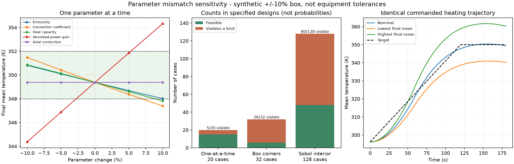

# 第三阶段：标称加热方案的参数失配筛查

日期：2026-09-24。这是合成模型的敏感性研究，不是设备公差评估或实际失效概率估计。本轮没有新增优化、校准、鲁棒控制或AI算法。

## 核心结论

1. 标称方案的合格性不能直接推广到参数变化后的模型。在固定±10%研究箱体内，单因素20例中5例越界，联合角点32例中26例越界，联合内部128例中80例越界。
2. 当前轨迹的末态平均温度对吸收功率增益最敏感：只减少5%，末态从349.3798K降到346.8809K，低于348K下限。
3. 仅靠温度观测不能同时唯一辨识本模型中五类参数的绝对值：热容量、导热、对流、辐射和输入增益存在共同缩放对称性。后续校准必须先处理辨识条件，不能盲目把五个参数一起交给优化器。
4. 模型计算仍很便宜；本轮181个主工况及9个精化工况在一次进程中约20.63秒完成，没有支持引入复杂AI加速的成本证据。

## 实验控制

- 固定第二阶段完整非线性辐射模型和优化后的功率指令，不重新调参数使它通过。
- 固定目标、初始状态、几何、暴露面积、功率约束和升温时间。
- 只改变五个比例因子：发射率、对流系数、比热（质量固定，因此改变总热容量）、统一吸收功率增益、轴向导热。
- 每个比例范围为0.9–1.1，发射率实际范围0.81–0.99。范围是研究设定，不是从真实测量推定的公差。
- 指令保持不变；power_gain改变指令到真实吸收功率的映射。分别检查指令和实际功率的幅值及变化率，本轮均未越过输入限制。
- 181项：1个标称、20个单因素、32个五维角点、128个固定种子Sobol内部点。各组分别统计，不能把它们混合成“故障概率”。
- 所有主工况96单元、0.25秒输出、BDF、rtol=1e-10、atol=1e-11、CPU单线程。
- 实施前保存协议、工况、脚本、模型、功率来源与依赖锁定文件的SHA-256；旧实验产物未修改。

完整设计见protocol.md和results/config.json。

## 单因素结果

其余参数不变，仅改变表中参数：

| 参数 | −10%时末态均温 | +10%时末态均温 | 近标称每增加1个百分点的变化 |
|---|---:|---:|---:|
| 吸收功率增益 | 344.3647 K | 354.3258 K | +0.49805 K |
| 对流系数 | 351.4815 K | 347.3872 K | −0.20464 K |
| 热容量 | 350.8589 K | 347.8148 K | −0.15306 K |
| 发射率 | 350.8130 K | 348.0094 K | −0.14013 K |
| 轴向导热 | 349.3797 K | 349.3799 K | +0.0000112 K |

最后一列是−5%/+5%两个工况之间的中心差分，再除以10个百分点；它只描述此轨迹附近的末态均温，不是全局参数重要性排名。轴向导热对平均温度影响小，不能推导它对空间均匀性或其他输入不重要。

单因素20个工况中有5个不合格，全部是末态均温超出348–352K区间：

- 吸收增益−10%、−5%：温度不足；+10%：末态过高。
- 对流系数+10%、热容量+10%：温度不足。
- 发射率+10%时末态348.0094K，仅距下限约0.0094K，已标为近边界并精化复核。

单因素中没有超过360K峰温或12K空间温差限制。

## 联合扰动结果

| 组别 | 工况数 | 合格 | 不合格 | 末态不足 | 末态过高 | 峰温超360K | 空间温差超12K |
|---|---:|---:|---:|---:|---:|---:|---:|
| 标称 | 1 | 1 | 0 | 0 | 0 | 0 | 0 |
| 单因素 | 20 | 15 | 5 | 4 | 1 | 0 | 0 |
| 联合角点 | 32 | 6 | 26 | 14 | 12 | 2 | 0 |
| 联合内部 | 128 | 48 | 80 | 51 | 29 | 0 | 0 |

各项违反数可能重叠，例如2个角点同时超过峰温与末态上限。内部80/128=62.5%只是固定Sobol样本集中的不合格比例，不代表真实生产中62.5%会失败；这里既没有真实参数分布，也没有统计失效概率模型。

- 联合角点末态均温范围340.2098–360.2772K。
- 联合内部末态均温范围341.8360–357.6830K。
- 全部主工况最高峰温362.0509K，超过限制2.0509K：发射率/对流/热容量/导热各−10%，吸收增益+10%。
- 全部主工况最大空间温差2.0209K，仍低于12K。因此这一任务的主要脆弱点是总体升温量，不是空间均匀性限制。



## 校准前必须处理：共同缩放不可辨识性

这项分析是在扫描后发现并检查的数学性质；用的是预先生成的两个角点，没有增选校准数据或改变原统计。

模型可简写为：

`C T_t = K T_xx + g ΣP_j w_j − h A'(T−Ta) − ε σ A'(T⁴−Ta⁴)`

这里C是单位长度热容量，K是轴向导热系数，g为吸收增益。固定几何、初始状态和输入时，将C、K、g、h、ε全部乘同一个正数λ，方程左右两侧同时乘λ，温度解不变。

对预设角点的实测核查：

| 同比缩放 | 与标称温度均值轨迹最大差 | 均值/极值/标准差轨迹的最大差 |
|---|---:|---:|
| 全部×0.9 | 1.86e-10 K | 3.81e-9 K |
| 全部×1.1 | 1.09e-10 K | 4.24e-9 K |

累计热量则按比例改变，说明“温度一样”并不意味着绝对功率、热容量或能量一样。记录见results/scaling-symmetry.json。

因此，温度数据通常只能约束与C的比值，例如K/C、g/C、h/C、ε/C；不能仅靠换一个拟合算法恢复共同尺度。增加温度传感器或在同样模型下多做几条加热轨迹也不会打破这一严格对称性。

后续可以选择：

1. 通过独立测量固定总热容量或实际吸收功率增益中的一个尺度量，再估计其余参数。
2. 只辨识控制所需的有效比值，不把它们宣传为真实绝对物性。

打破共同尺度并不保证其余参数就能准确识别。例如对流和辐射在有限温区内仍可能产生相似响应，需要另检查观测位置、激励和噪声下的实用可辨识性。这一问题不能被“拟合误差小”替代。

## 数值与执行验证

- 标称温度、MSE和标准差与第二阶段严格细网格结果一致至1e-6以内。
- 全部181项通过无NaN/非正温度、功率限制、全局能量余额、节点功率精确积分和独立热流时间积分检查。
- 主扫描独立对流/辐射积分的最大单项误差约8.94e-6J，小于预设0.1J门槛。
- 按预设规则选出9个去重工况，包括标称、最差、最冷/最热及最接近边界项；用192单元、0.0625秒输出和更严格时间容差复核。
- 复核中温度类标量最大变化0.001341K，小于0.01K门槛；9项均无约束分类翻转。没有据此声称所有时空点或全部181项都已精化证明。
- 验证脚本从保存的均温/标准差轨迹重算MSE，从极值轨迹重算约束，从独立热流重算热量，并重新统计各组违反数。
- 主扫描求解时间合计13.02秒；包含9项精化、I/O和分析的进程时间20.63秒。只是本机单次成本，不是跨硬件性能保证。

## 产物与重跑

在本目录执行：

```sh
set -o pipefail
timeout 240s ../feasibility/.venv/bin/python -u run_sensitivity.py 2>&1 | tee rerun.log
../feasibility/.venv/bin/python -u verify_and_plot.py 2>&1 | tee verification-rerun.log
```

- 已有同配置记录时，扫描跳过完成项，校验轨迹哈希并续跑；不会再次计算全部耗时。配置、模型、代码或依赖锁定变动时拒绝混跑，需先显式归档整个results目录。
- 每项工况记录位于results/scan.jsonl，精化位于results/refinements.jsonl，完整设计和依赖哈希位于results/config.json。
- 每个NPZ保存时序统计量和能量/热流，不保存全部温度空间场；足以复算本轮公布指标，但不等于完整原始场归档。需要场分布时可按冻结参数重新求解。
- 本次单进程完成181项，无跨进程拼接、失败跳过或追加优化。执行日志run.log保留全部合格和越界工况。
- verification.log区分“数值验证PASS”与“部分工况违反要求”；两者不是矛盾，也不能把PASS误读成所有扰动都合格。

## 下一步决策

**值得继续的是有可辨识性约束的模型校准，而不是先做五参数联合拟合或换大模型。** 应首先确定拟合有效参数比值还是增加独立物理测量；再预先固定校准输入、噪声和未参与拟合的验证轨迹，与标称方案及鲁棒方案对照。

本轮扫描工况已经用于分析，不能日后又当成完全未看过的测试集。此处的敏感性证据不保证校准会提升结果，也不证明鲁棒优化在该箱体内一定存在可行解。当前模型成本低，仍不推荐以AI/多保真加速为主要卖点。
